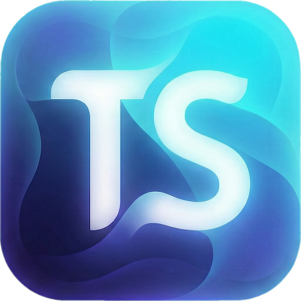

# TSSLint: A Minimalist TypeScript Diagnostic Tool

<p align="center">
  
</p>

<p align="center">
  <a href="https://npmjs.com/package/@tsslint/core"></a>
  <a href="https://discord.gg/NpdmPEUNjE"></a>
  <a href="https://github.com/johnsoncodehk/tsslint/tree/master/LICENSE"></a>
</p>

**TSSLint** is a diagnostic tool crafted to seamlessly extend your TypeScript development environment. It integrates directly with the TypeScript Language Server (`tsserver`), offering a pathway to define and apply custom code quality rules with a focus on developer experience and a minimalist implementation.

## Our Philosophy

TSSLint is built upon two core principles:

1.  **Developer Experience (DX) over Raw Performance for Custom Rules**: While overall performance is paramount, TSSLint prioritizes making custom rule authoring as intuitive and straightforward as possible. We believe that the ease with which developers can express their code quality requirements directly in TypeScript, leveraging the native TypeScript AST, outweighs the marginal performance gains of overly complex, abstracted rule engines.
2.  **Minimalist Implementation**: TSSLint aims to be as small and unobtrusive as possible. Instead of duplicating functionality, it leverages the existing `tsserver` instance that your IDE already runs. This approach minimizes resource consumption and reduces the tool's footprint, ensuring it remains a lightweight diagnostic engine rather than a heavy, standalone linter.

## How TSSLint Works

TSSLint operates as a TypeScript Language Server Plugin. This design choice means it reuses the `TypeChecker` instance already managed by your editor for providing core language features. By doing so, TSSLint adds custom diagnostic capabilities without introducing the additional overhead typically associated with separate type-checking processes.

This integration allows TSSLint to provide timely and relevant feedback on your code, harmonizing with your existing `tsserver` setup.

## Features

*   **Integrated Diagnostics**: Extends `tsserver` to provide custom diagnostic messages directly in your editor.
*   **TypeScript Configuration**: Define your linting rules and configurations using TypeScript, benefiting from type safety and autocompletion.
*   **Meta-Framework Friendly**: Supports various project types, including Vue, Astro, and MDX, by working with the underlying TypeScript language services.
*   **Direct Rule Development**: Offers direct access to the TypeScript Abstract Syntax Tree (AST) for crafting precise and powerful custom rules, emphasizing DX.

## Getting Started

To begin using TSSLint in your VSCode environment:

1.  **Install the VSCode Extension**:
    *   [TSSLint for VSCode](https://marketplace.visualstudio.com/items?itemName=johnsoncodehk.vscode-tsslint)

2.  **Add Dependencies**:
    ```bash
    npm install @tsslint/config typescript --save-dev
    ```

3.  **Create `tsslint.config.ts`**:
    Place a `tsslint.config.ts` file in your project root:
    ```typescript
    import { defineConfig } from '@tsslint/config';

    export default defineConfig({
      rules: {
        // Your custom rules or imported rules go here
      },
    });
    ```

## Creating a Custom Rule

In line with our philosophy of prioritizing Developer Experience for custom rules, TSSLint offers a straightforward process for rule authoring by providing direct access to the TypeScript AST.

**Example: A simple `no-debugger` rule**

```typescript
// rules/no-debugger.ts
import { defineRule } from '@tsslint/config';

export default defineRule(({ typescript: ts, file, report }) => {
  ts.forEachChild(file, function cb(node) {
    if (node.kind === ts.SyntaxKind.DebuggerStatement) {
      report(
        'The `debugger` statement is not allowed.',
        node.getStart(file),
        node.getEnd()
      );
    }
    ts.forEachChild(node, cb);
  });
});
```

**Enable the rule in `tsslint.config.ts`**:

```typescript
import { defineConfig } from '@tsslint/config';
import noDebuggerRule from './rules/no-debugger';

export default defineConfig({
  rules: {
    'no-debugger': noDebuggerRule,
  },
});
```

Once configured, TSSLint will provide diagnostic feedback for `debugger;` statements in your code.

## ESLint Compatibility

TSSLint offers robust compatibility with existing ESLint rules through the `@tsslint/eslint` package, allowing you to leverage the vast ESLint ecosystem within TSSLint's minimalist architecture.

1.  **Install `@tsslint/eslint` and ESLint plugins**:
    ```bash
    npm install @tsslint/eslint @typescript-eslint/eslint-plugin @typescript-eslint/parser eslint --save-dev
    ```

2.  **`postinstall` Script and pnpm Considerations**:
    `@tsslint/eslint` utilizes a `postinstall` script to generate type definitions for `defineRules`, enhancing Developer Experience with autocompletion and type safety.

    When using **pnpm**, ensure `postinstall` scripts are allowed. A common approach is to configure `onlyBuiltDependencies=false` in your `.npmrc` to enable the execution of all `postinstall` scripts.

3.  **Use `defineRules` in `tsslint.config.ts`**:
    The `defineRules` function from `@tsslint/eslint` converts ESLint rules into TSSLint-compatible rules. You can pass an object of ESLint rules and their configurations directly to it:

    ```typescript
    // tsslint.config.ts
    import { defineConfig } from '@tsslint/config';
    import { defineRules } from '@tsslint/eslint';

    export default defineConfig({
      rules: {
        ...await defineRules({
          // Example: Enabling a specific ESLint rule
          'for-direction': true,
          'no-debugger': true,

          // Example: Enabling rules from @typescript-eslint/eslint-plugin
          '@typescript-eslint/await-thenable': true,
          '@typescript-eslint/no-duplicate-enum-values': true,

          // You can also configure rules with options
          '@typescript-eslint/consistent-type-imports': [
            { disallowTypeAnnotations: false, fixStyle: 'inline-type-imports' },
          ],
        }),
        // Your custom TSSLint rules can still be defined here
        // 'my-custom-tsslint-rule': myCustomTsslintRule,
      },
    });
    ```

This compatibility allows you to consolidate code quality checks under TSSLint, benefiting from its minimalist architecture while still leveraging the vast ESLint rules ecosystem.

## CLI Usage

The `@tsslint/cli` package offers a command-line interface for integrating TSSLint into your build processes or CI/CD pipelines.

*   **Lint a project**:
    ```bash
    npx tsslint --project path/to/your/tsconfig.json
    ```

*   **Auto-fix errors**:
    ```bash
    npx tsslint --project path/to/your/tsconfig.json --fix
    ```

*   **Lint multiple projects (e.g., Vue, Astro)**:
    ```bash
    npx tsslint --project 'packages/*/tsconfig.json' --vue-project 'apps/web/tsconfig.json'
    ```

## Technical Considerations

While TSSLint offers significant advantages, it's important to be aware of its current technical considerations:

1.  **TypeScript v7 (typescript-go) Compatibility**: As of now, `typescript-go` (TS v7) does not support Language Service Plugins. This means if your IDE is configured to use TS v7, TSSLint will not function within the IDE environment.
2.  **Rules API Performance**: The Rules API is designed for simplicity and direct access to the TypeScript AST. However, unlike some other linters that use node visitors, the direct AST traversal for rule execution might be comparatively slower. Nevertheless, this node traversal cost is generally negligible when compared to the overall type-checking time saved by TSSLint's minimalist approach.

## Contributing

We welcome contributions! Please feel free to open an issue or submit a pull request.

## License

[MIT](LICENSE)
